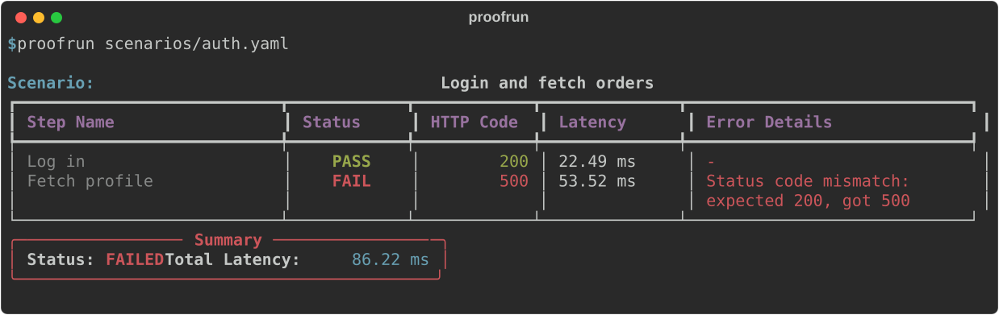
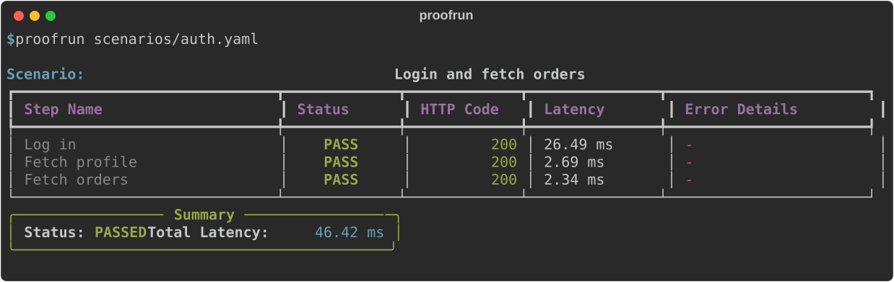

<div align="center">

# Proofrun

**Write an API workflow in YAML. Run it locally, in CI, or as a monitor that only alerts when health changes.**

[](https://www.python.org/)
[](https://github.com/Kishan-Thanki/proof/actions/workflows/ci.yml)
[](https://github.com/Kishan-Thanki/proof/releases)
[](LICENSE)

</div>

---

Most monitors tell you an endpoint returned `200`. Proofrun tells you whether the
*journey* works: log in, take the token from the response, use it on the next
request, and check what comes back.

When something breaks, you see exactly which step failed and why:

<div align="center">
  
</div>

And when everything is fine:

<div align="center">
  
</div>

**YAML in. HTTP checks out. No database, queue, or external service required.**

- **One file describes the workflow.** Scenarios live in Git next to your code.
- **Multi-step.** Values extracted from one response feed the next request.
- **Runs anywhere.** Same file locally, in CI (exit code `0` / `1`), or as a daemon.
- **Quiet by design.** In daemon mode you are alerted when health *changes*, not on every failed check.

## Quickstart (30 seconds)

**1. Install** (Python 3.11+):

```bash
pipx install proofrun
```

Or with pip: `pip install proofrun`

**2. Create `health.yaml`:**

```yaml
version: "1.0"

global:
  base_url: "https://jsonplaceholder.typicode.com"

scenarios:
  - name: "Public API is up"
    steps:
      - name: "GET /posts/1"
        request:
          method: GET
          path: /posts/1
        expect:
          status: 200
          max_latency_ms: 2000
```

**3. Run it:**

```bash
proofrun health.yaml
```

That's it. Swap in your own `base_url` and paths. Add `--daemon` to keep it
running.

## A realistic example: log in, then use the token

This is the scenario from the screenshots above. It logs in, extracts the
access token with JSONPath, sends it as a `Bearer` header on the next request,
extracts the user id from *that* response, and uses it in the URL of the third.

```yaml
version: "1.0"

global:
  base_url: "http://127.0.0.1:8099"
  timeout_seconds: 5

scenarios:
  - name: "Login and fetch orders"
    steps:
      - name: "Log in"
        request:
          method: POST
          path: /login
          json:
            email: "demo@example.com"
            password: "demo-password"
        expect:
          status: 200
          max_latency_ms: 1000
        extract:
          token: "$.access_token"         # saved as ${token}

      - name: "Fetch profile"
        request:
          method: GET
          path: /me
          headers:
            Authorization: "Bearer ${token}"    # used here
        expect:
          status: 200
        extract:
          user_id: "$.id"                 # saved as ${user_id}

      - name: "Fetch orders"
        request:
          method: GET
          path: "/users/${user_id}/orders"
          headers:
            Authorization: "Bearer ${token}"
        expect:
          status: 200
          schema:                         # JSON Schema validation
            type: array
            minItems: 1
```

Steps run in order and stop at the first failure, so the report points at the
step that actually broke. You can try this without any external service. The
repo includes a tiny local API:

```bash
# terminal 1: start the demo API
python scenarios/server.py

# terminal 2: run the scenario (passes, exit code 0)
proofrun scenarios/auth.yaml
```

Now break it on purpose. Restart the demo API with `--break`, which makes
`GET /me` return `500`, and run the same scenario again:

```bash
python scenarios/server.py --break
proofrun scenarios/auth.yaml       # fails, exit code 1
```

## What you can assert

Each step's `expect` block supports:

| Assertion | Example | Notes |
| --- | --- | --- |
| `status` | `status: 200` | Required. |
| `max_latency_ms` | `max_latency_ms: 500` | Fails if the response is slower. |
| `headers` | `headers: { Content-Type: "application/json" }` | Exact match. |
| `schema` | inline JSON Schema, or a path to a file | Validates the JSON response body. |

A step can also `extract` values with JSONPath for later steps. Besides your own
variables, built-in dynamic values are available anywhere you can write `${...}`:
`${$uuid}`, `${$timestamp}`, `${$timestamp_ms}`, `${$iso_timestamp}`,
`${$random_int}`.

Defaults you set under `global` (`base_url`, `timeout_seconds`, `headers`) apply
to every step, and any step can override its own `headers` and `timeout`.

## Run it continuously

```bash
proofrun monitors/api.yaml --daemon
```

In daemon mode Proofrun re-runs your scenarios on a loop and tracks each one as
`HEALTHY` or `FAILING`.

* **Alerts on change, not on repetition.** A webhook fires when a scenario starts
failing and again when it recovers. A scenario that stays down does not
re-alert on every cycle.
* **Edit configs live.** Changes to the YAML are picked up without a restart. If
an edit is invalid, Proofrun keeps running the last working configuration.
* **Jittered schedule.** Sleep time varies by ±15% so checks don't all land on
the same second.

Send alerts to any HTTP endpoint:

```bash
proofrun monitors/api.yaml --daemon --webhook-url https://<your_domain>/hooks/proofrun

# or

export PROOFRUN_WEBHOOK_URL=https://<your_domain>/hooks/proofrun
```

The webhook receives plain JSON:

```json
{
  "event": "scenario_failed",
  "scenario": "Login and fetch orders",
  "previous_status": "HEALTHY",
  "status": "FAILING",
  "details": "- Fetch profile: Status code mismatch: expected 200, got 500"
}
```

`event` is `scenario_failed` or `scenario_recovered`.

## Use it in CI

Proofrun exits with `0` when every scenario passes and `1` when any fails, so it
works as a smoke test or a scheduled check. For example, with GitHub Actions:

```yaml
name: API check
on:
  schedule:
    - cron: "*/15 * * * *"
  workflow_dispatch:

jobs:
  proofrun:
    runs-on: ubuntu-latest
    steps:
      - uses: actions/checkout@v4
      - uses: actions/setup-python@v5
        with:
          python-version: "3.12"
      - run: pip install proofrun
      - run: proofrun monitors/api.yaml
```

A failing check fails the workflow run, and GitHub notifies you the way it
notifies you about any failed workflow.

## CLI

```bash
proofrun <config.yaml>                 # run once and exit (default)
proofrun <config.yaml> --daemon        # run continuously
proofrun <config.yaml> --interval 30   # override the daemon interval (seconds)
proofrun <config.yaml> --daemon --webhook-url <url>
proofrun --version
```

## License

[MIT](LICENSE)
